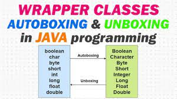

# wrapper class

---> wrapper class are those whose objects are the corresponds to the primitive datatypes.

---> wrapper class are those whose object wraps the primitive data types.

---> The wrapper class in java provides the mechanism to convert the primitive into object and object into primitive.

---> Wrapper classes comes under the java.util package.

Wrapper classes of the corresponding data types are in the below image :)

