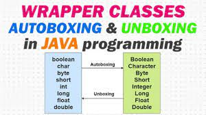

# wrapper class

---> wrapper class are those whose objects are the corresponds to the primitive datatypes.

---> wrapper class are those whose object wraps the primitive data types.

---> The wrapper class in java provides the mechanism to convert the primitive into object and object into primitive.

---> Wrapper classes comes under the java.util package.

---> Wrapper classes of the corresponding data types are in the below image :)

----> Wrapper class are of two different types

1. Autoboxing
2. Unboxing

# 1. Autoboxing :-

a. The automatic conversion of the primitive data types into it's corresponding wrapper class is known as the autoboxing.
eg:- int to Integer, long to Long
b. It is primitive to wrapper.
c. example program is in Autoboxing.java file.

# 2. Unboxing:-

a. The automatic conversion of the wrapper class into it's corresponding primitive data type is known as the unboxing.
b. It is the reverse of the Autoboxing.
c. It is wrapper to primitive.
d. example program is in Unboxing.java file.

# Strings in java are immutable(non-changeable)

It means once you assign a value to the string variable and if you try to change it, it will not replace the old object but it will create the new object for us.

# class and objects

class: - prototype(design) of an object is class.
object:- An instance of class is object.
