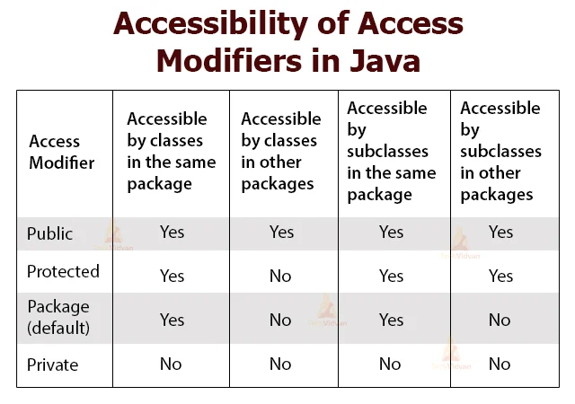

# question practise

# Question no. 1 Create a class Employee with ID, name. Create a parameterized constructor to initialize instance variables. Override the toString() method to display Employee details.

answer: Solution.java

# Access-modifier in java

Modifiers are the keywords in object oriented languages that set the accessibility of classes, methods and other members.

access modifier in java has the following characteristics:-

1. Access modifiers in java defines the scope or the accessiblity of any MCCF(method, constructor, class or field)
2. We can change the accessing level of any MCCF by adding the access modifier in it.
3. In java, there are 4 different types of access modifier which are ppppd(private, public, protected and default).

4. Working field of these modifier is shown in table below.

   

# Types of java package

Package is one of the feature of the feature of the java that arranges number of classes, interfaces and sub type of packages of same type into a particular group.

# Types of Java Package

1. Pre-defined/built in package // java API eg;- java.util.Scanner
2. user defined package // custom package

# Using a java package

import java.lang.\* --> import everything from java.lang
import java.lang.String --> import string form java.lang
s = new Java.lang.String("API") --> Using without importing

for reference see day-3 takingInput_03.java file

# Question no. 2

# Design a class called Computer. Each computer has a brand name, price and storage. Storage can be either SDD/HDD amd has a storage base. Also implement a method to print the detail of each computer.

solution : - Answer_01.java

# Example of Abstract class

see Answer_02.java file.

# Interface

Interface is a group of functions that are abstract. It has following characteristics :-

1. It is created using "Interface" keyword.
2. Interface can be defined using "implements" keyword.
3. The field in the interface are always public, final and static.
4. Interface doesn't allow to use a constructor.
5. Interface supports the multiple inheritance.
6. Interface is used to provide the abstraction.
7. SYNTAX:-
   interface InterfaceName{
   public void method1();
   public void method2();
   }
8. IMPLEMENTATION:-
   class ClassName implements InterfaceName{
   //body of the class
   }

   Interface example: refer to Interface_Example.java

# Difference between Abstract class and Interface

1. ---> Abstract class doesn't support multiple inheritance whereas
   ---> Interface support multiple inheritance.
2. ---> Abstract class can have final, non-final, static and non-static variables whereas
   ---> Interface can have only static and final variables.

3. ---> Abstract class can have private, protected, public and default members whereas
   ---> All members are public by default.
4. ---> It can have both abstract and non-abstract method whereas Interface can have only abstract method.
5. ---> Interface doesn't allow to declare a constructor whereas abstract class can declare a constructor.
6. ---> Abstract class can provide implementation of interface whereas Interface can't provide implementation of abstract class.
7. ---> Abstract class can extend from another class or from multiple interfaces whereas Interfaces can only extend from another interfaces.
