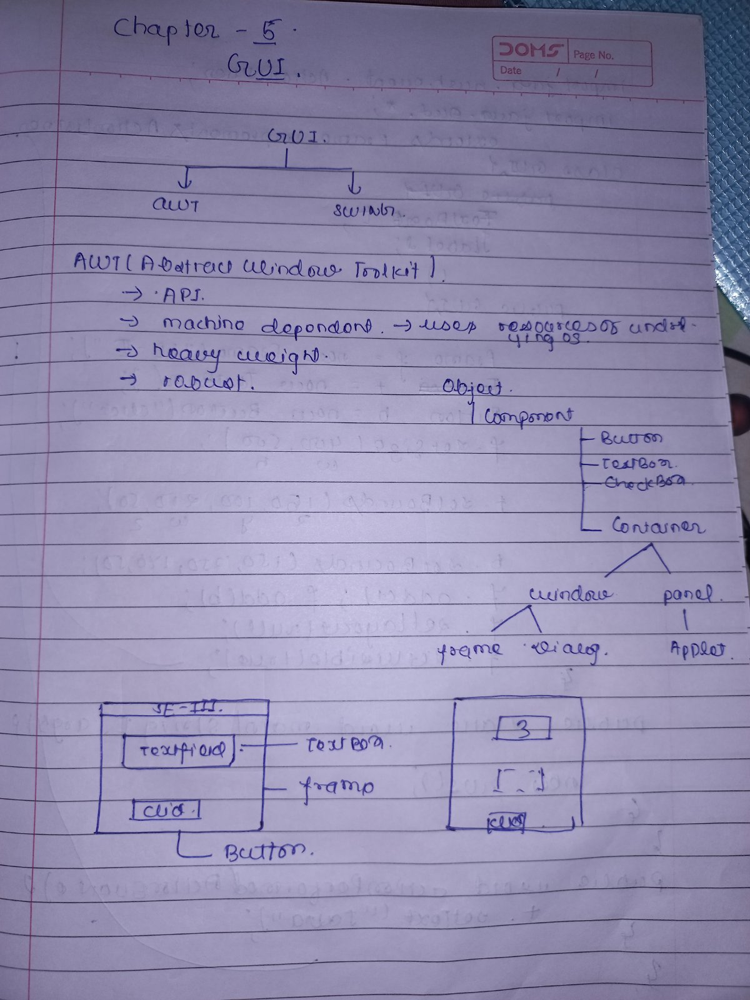
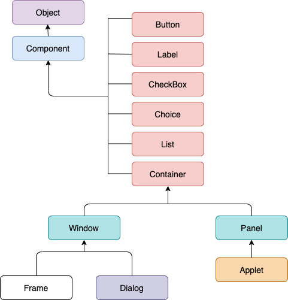
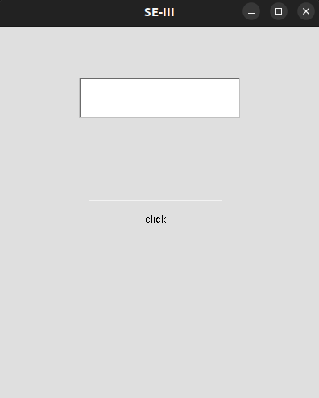
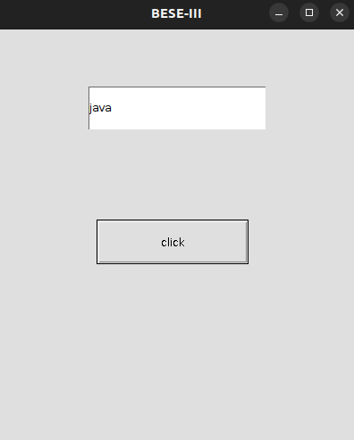
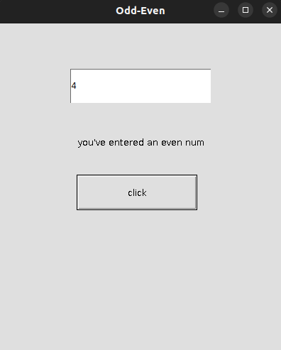
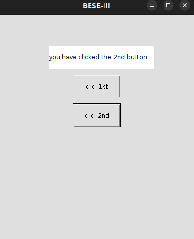
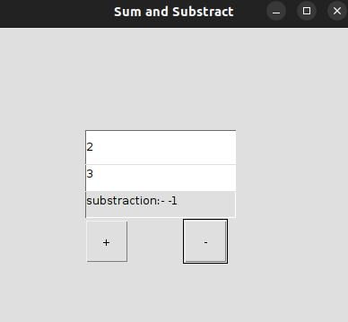
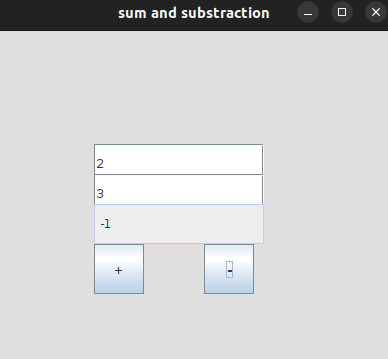
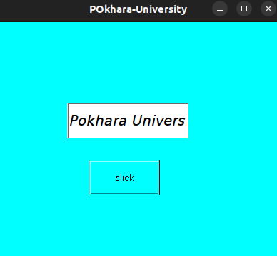
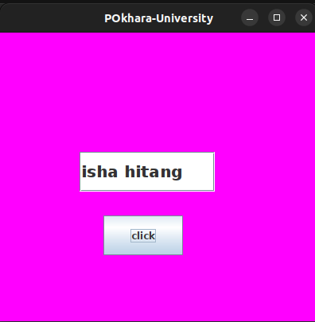

There are currently three sets of java APIs/packages for graphics programming.

1.  AWT (Abstract Window Toolkit)
2.  Swing
3.  JavaFx

#

3.  **AWT(Abstract Window Toolkit)** :-

           **Java AWT Hierarchy**

    

---> AWT is an API(Application Programming Interface) for creating Graphical User Interface(GUI) that allows programmers to develop window-based applications.

---> Java AWT components are platform dependent i.e components are displayed according to the view of OS.

---> AWT is heavyweight i.e its components are using the resources of OS.

---> java.awt package is used.

                              **Components**
            => All the elements like button, textfields, scroll bars are called components.

            =>In java awt, there are classes for each components as shown in above AWT Hierarchy.

            => In order to place every component in a particular position on a screen, we need to add them in a container.

#

                                **Container**

    => The container is the component in AWT that can contain another components like buttons, textfields, labels etc.

    => The class that extends Container class are also known as container such as frame, dialog and panel.

    => Types of containers :-

    a. Window
    b. Frame
    c. Dialog
    d. Panel
                                **Window**
    a.The window is the container that have no borders and menu bars.
    b. Must have to use frame, dialog or another window for creating a window.

                                **Frame**
    a. Frame is the container that contain the title bars. It can have other components like buttons, textfields, etc.

    b. Frame has maximaize and minimize buttons.

                                 **Dialog**
    a. It contains a top level window with a border and a title used to take some form of inputs from the user.

    b. It inherits the window class.

    c. It doesn't have maximize and minimize buttons.

                            ACTIONLISTENER INTERFACE

- ActionListener in Java is an Interface that is responsible for handling action events such as when teh user clicks the Button.

* The java ActionListener is notified whenever you click on the button or the menu button.

* It is notified against ActionEvent.
* ActionListener interface is found in java.awt.event package.
* The class which process the ActionEvent should implement the interface ActionListener.
* The object of the class must be registered using addActionListener(instanceoflistenerclassmethod) with a component.

* Here, `First.java` and `Second.java` program file fulfils the following requirements :-

- Here, `ActionListener1.java` program file fulfils the following requirements :-

- Here, `ActionListener1.java` program file fulfils the following requirements :-

- Here, `EventObject1st.java` program file fulfils the different tasks performed by the 2 different buttons.

1. It fulfils the following requirements.

2. It's done using the EventObject class which is under the java.util package that holds the information about something that happened to it's source.

3. Here, we use the Object getSource(), the object in which the the Event initially occurred.

# Important question:- Create a swing GUI that contains two buttons add and substract and 3 textField, when the buttos are clicked, sum or difference of values of first two textField should be displayed in third textField.

Answer- **<u>SumandSubsButton.java</u>** `using awt`

Answer- **<u>SumandSubs.java</u>** `using swing`

# Important question 2018 fall:- Create a graphics application to display Pokhara University with font 'Aerial', type 'bold', size '20' when a button is clicked with frame background CYAN.

- using `awt`

  refer **<u>PU.java</u>**

  

* using `swing`

  refer **<u>PU1.java</u>**

  

  1. Another method to solve the above prblem....

  - using anonymous class ===>**Controller.java**

  * using outerclass ===> **Controller2.java**
