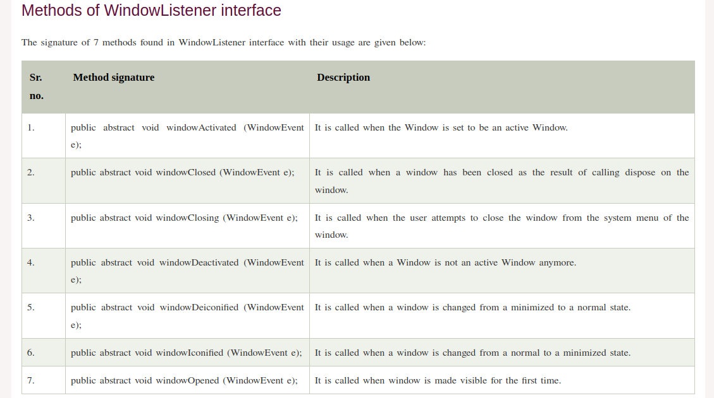
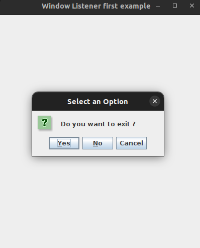

# `Creating the Dynamic Menu with java using swing`

**`JPopupMenu()`**

- Used to implement the popup menu - a small window that pops up dynamically at a specified position and displays a series of choices.

* It belongs to the javax.swing.JPopupMenu package.

## `Constructors of the class JPopupMenu are`:-

- JPopunMenu():- creates a popup menu with empty name.
- JPopupMenu(String name): creates a popup menu with specified title.

### `Commonly used methods of JPopupMenu are`:`-

- show(Component c, intx, int y):- displays the popup menu at x, y position within the component c.

- add(JMenuItem menuitem):- add menu item to the popup menu.

- add(String s):- add String to the popup menu.

> more to continue from window listener.

#

# WindowListener

- 

* **_First example program of the windowlistener_**:-**WindowExam1st.java**

* **_output of the above program_** :-

* **Second example program of the windowlistener**:-**WindowExam2nd.java**

# LayoutMangers

- The LayoutManagers are used to arrange components in a particular manner.

* Layoutmanager is an interface that is implementd by all the classes of layout mangers.
* There are the following classes that represents teh layout mangers. 1. java.awt.BorderLayout(default layout of the frame)

         2. java.awt.FlowLayout

         3. java.awt.GridLayout

         4. java.awt.CardLayout

         5. java.awt.GridBagLayou

         6. javax.swing.BoxLayout

         7. javax.swing.GroupLayout

         8. javax.swing.ScrollPanelLayout

         9.javax.swing.SpringLayout

  **1.java.awt.BorderLayout**

* The BorderLayout is used to arrange the components in five region: north, south, east, west and center.
* Each region(area) may contain one component only.
* It is the default layout of the frame.

  **Constructors of the BorderLayout class**

  - BorderLayout(): creates a border layout but with no gaps between the components.
  - BorderLayout(int horizont_gap, int vert_gap): creates a border layout with the given horizontal and vertical gaps between the components.

  --<b>Example of BorderLayout class: USIING BorderLayout() construcotr</b>--
