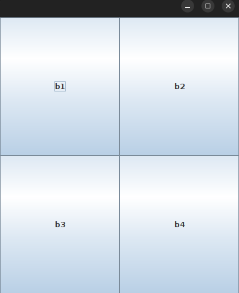
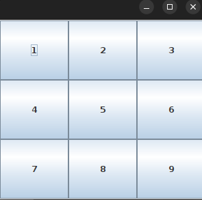
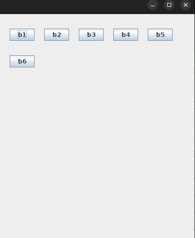

# Layout Mangers

**<b>2.java.awt.GridLayout</b>**

- The Java GridLayout class is used to arrange the components in a rectangular grid having no of rows and no of columns.

* One component is displayed in each rectangle.

**Constructors of the GridLayout**

- new GridLayout():- Creates a grid layout with one column per compnent in a row

- new GridLayout(int row, int cols):- Creates a grid layout with the given rows and columns but no gaps between the components

- new GridLayout(int rows, int cols, int hgap, int vgap):- Creates a grid layout with given rows and columns along with given horizontal and vertical gaps.

**Example of the GridLayout Layout Mangager**:- GridExam.java, MyGridLayout.java

**<b>2.java.awt.FlowLayout</b>**

- The Java FlowLayout class is used to arrange the components in a line, one after another (in a flow).

- It's the default layout of the Applet or Panel.

**Constructor of FlowLayout class**

- new FlowLayout():- creates a flow layout with centered alignment and default 5 unit horizontal and vertical gap.

- new FlowLayout(int align):- creates a flow layout with the given alignment and a default 5 unit horizontal and vertical gap.

- new FlowLayout(int align, int hgap, int vgap):- creates a flow layout with the given alignment and the given horizontal and vertical gap.

**Fields of FlowLayout class**

i. public static final int LEFT
ii. public static final int RIGHT
iii. public static final int CENTER
iv. public static final int LEADING
v. public static final int TRAILING

**Example of the FlowLayout**:- MyFlowLayout.java

