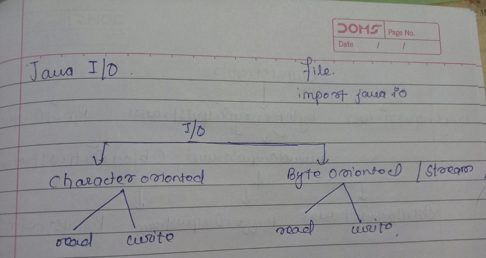
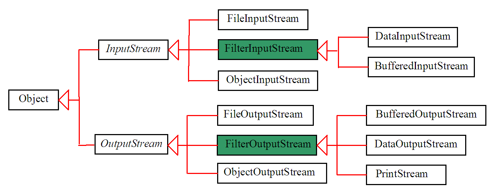
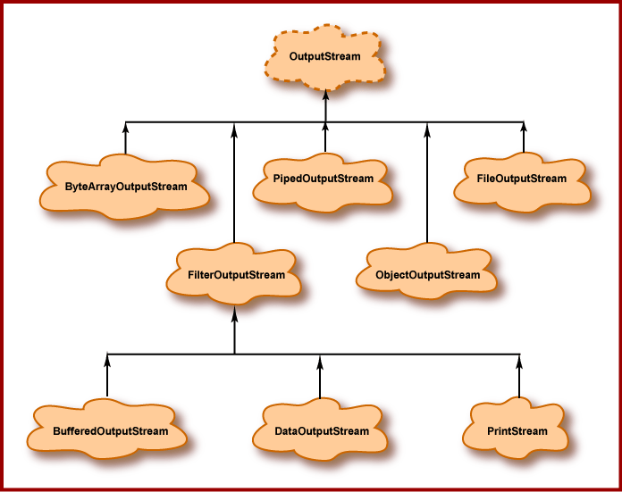

# JAVA I/O

**Streams in java are the sequence of bytes of undetermined length. It can be compared to water streams**

# FileInputStream and FileOutputStream class

**InputStream class can be used to read the data from a data file.**

**OutputStram class are used to write the data in a data file**

a. Used to read and write data in a file.

b. Prefer this when primitive datatype values are to be written.

c. For character oriented data, it's prefer to use FileReder and FileWriter class

d. For Byte oriented data, it's prefer to use FileOutputStram class and FileInputStream.

**e.Now let's see how we can read bytes from the file using the FileInputStream**

Solution see in **["FileInputStreamExample.java"]**

f. FileInputStream class doesn't make a new file for us if there is not present of the accessed file name.

g. FileOutputStrem class creates the new file for us if there is not present of the accessed file name.

**Question imp for exam:- Write a java program to read form one file and writes it's content to another file using the FileInputStream/FileOutputStream as well as the FileReader and FileWriter class.**

Solution see in **["ReadFromOneAndWriteInAnother.java"]** using FileInputStream/FileOutputStream

Solution see in **["ReadFromOneAndWriteInAnother2.java"]** using FileReader/FileWriter

# Java FileReader and FileWriter class

a. Use to read and write the data from text file.
b. They are character-oriented classes.

**Example program of the java FileReader: - ["FileReaderExam.java"]**
**Example program of the java FileWriter: - ["FileWriterExam.java]**

# Java ByteArrayOutputStream class

a. Used to write single data into multiple files.

b. Data is written into byte array that can be written to the multiple streams.

**c.Example program:- ["ByteArrayOutputStreamExam.java"]**
Example no. 2 :- **["ByteArrayOutputStreamExam2.java"]**

In the above example, we have created an array of bytes to store the data returned by the toByteArray() method.

We then have used the for loop to access each byte from the array. Here, each byte is converted into the corresponding character using typecasting.
