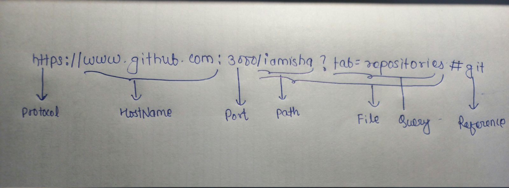

1. **`URL:`**
* It is a class that is used to represent URL
* It is a package of java.net.
* A url is devided into the many sections;

* Example program 💯

         URLMthod.java

**output://**

         Protocol:- https
    
         Domain/Host:- www.github.com

         Authority:- www.github.com:3000

         Port Number:- 3000

         Default Port Number:- 443

         Path:- /iamisha

         File:- /iamisha?tab=repositories

         Query String :- tab=repositories

          Anchor/Reference:- git
  
          URI:-https://www.github.com:3000/iamisha?tab=repositories#git

          URL String:- https://www.github.com:3000/iamisha?tab=repositories#git

2. **`URLConnection:`**
* URLConnection class is used to read/write data string of a given URL.
* The java URLConnection class represents the communication between the URL and the application.
* The openConnection() method of the URL class returns the object of the URLConnection class.
* **SYNTAX:-** 

        public URLConnection openConnection throws IOException{
            
* **Example program** 

        URLConnectionExam.java

3. **`ResponseHeader`**

* It helps to print the Httpresponse
* **Example:**
   
       PrintHttpResponse.java

* **Output://**

        Response code:- 200

        Response Message:- OK

        Connection Timeout:- 0

        Encoding:- null

        Length of content:- -1

        Content type:- text/html; charset=utf-8

        Request Type:- GET

        Date:- 1673782416000
       
4. **`HashMap`**

* It is an interface that contain values based on keys.
* Not ordered
* 'Key' should be unique.
* 'Value' can be repeated.
* It implements interface Map.
* It is found in java.util package.

* **Example:-** 
        
        HashMapExam.java

 **output://**

        using put() method to insert the key and value

        {Isha=201710, Priyanka=201725}

        Printing if the specified hashmap contains the following key or not

        true

        false

        true

        false

        key is present in the map

        201710

        get method simply prints the value of the specified key if the key is present otherwise it returns null

        201710

        null

        only for test purpose

        1 2 33 

        1 2 33 

        Printing the key with their values through entrySet()

        Isha

        201710

        Priyanka

        201725

        Printing the key with their values through keySet()

        Isha 201710

        Priyanka 201725

        removing any pair in HashMap

        {Priyanka=201725}

**Qn:-** Write a java program to print all HTTP Request Headers

**Solution:-** 

        Header.java

5. **`InetAddress`**
* It is a class that represents IP addresses.
* InetAddress class provides methods to get the IP addresses of any host name.
* Some of the method are:- 

        1. public String getHostName():-
        Returns the hostname of the Address.

        2. public String getHostAddress():-
        Returns the IP Address in string format.

        3. public static InetAddress getLocalHost() throws UnknownHostException:-
        Returns the instances of the InetAdddress containing local host name and address.

        4.public static InetAddress getByName() throws UnknownHostException:-
        Returns the instances of the InetAddress containing LocalHost IP and name.

        5. public static  InetAddress getAllByName() throws UnknownHostException:- 
        Returns the  array of list of the InetAddress.

* InetAddress is a class that allows us to work with IPAddress belongs to java.net package.
* It is a base class of both Inet4Address(Ipv4) and Inet6Address(Ipv6)

* **Example**:- 
    
        InetAddressExam.java

* **Output://**

        Host Name:- www.ishahitang.com.np

        IP Address:- 104.21.55.131
        
       Local Host Name:- isha-81wd
       
       LocalHost IP:- 127.0.1.1

**Qn.** Display all the IP addresses associated with the given URL.

* Solution:
        
        DisplayIPAddress.java